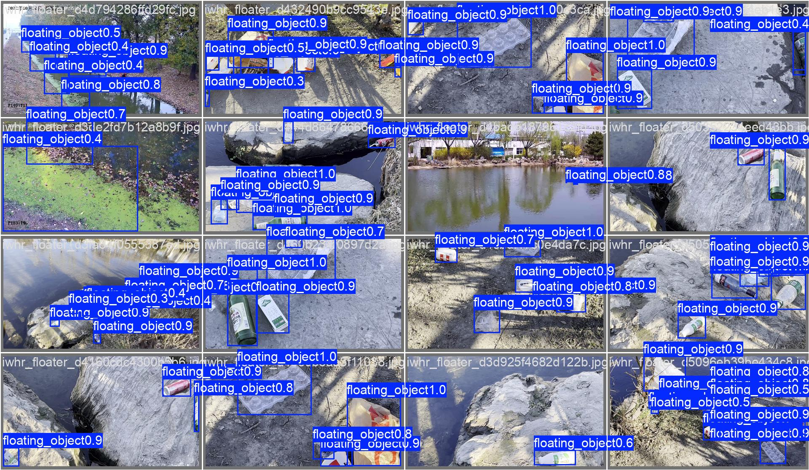
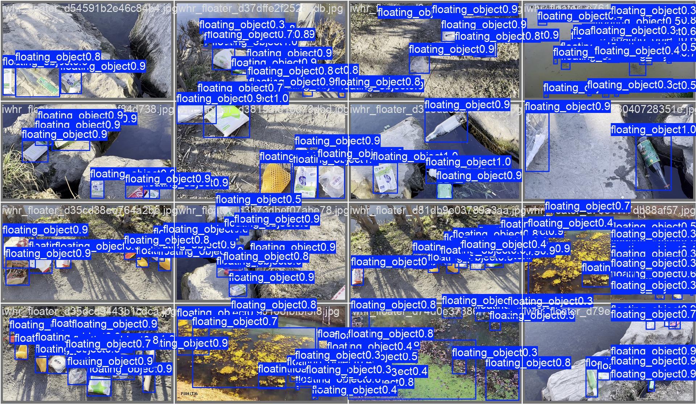

# Nautilus AquaVision v0

[](RELEASE_NOTES.md)
[](MODEL_CARD.md)
[](LICENSE)

**Nautilus AquaVision** is a lightweight, single-class object detector for locating floating objects and litter on water surfaces. This is the first experimental public release.

## Release highlights

| Item | Value |
|---|---:|
| Architecture | Ultralytics YOLO26n |
| Classes | `floating_object` |
| Input | 960 × 960 |
| Parameters | 2.50M train / 2.38M fused |
| ONNX size | 9.6 MB |
| Validation images / instances | 667 / 4,210 |
| Precision | 0.8971 |
| Recall | 0.8501 |
| mAP@0.50 | 0.9290 |
| mAP@0.50:0.95 | 0.6538 |
| Balanced confidence threshold | 0.395 |

The best checkpoint was selected at epoch **88** from a 100-epoch run. Metrics were recovered directly from the published `best.pt` checkpoint and the original Kaggle notebook.

## ONNX runtime requirements

The ONNX export was benchmarked locally with ONNX Runtime using the generated requirements report.

- Model file: `weights/nautilus-aquavision-v0.1.0-alpha.onnx`
- ONNX size on disk: **9.55 MiB**
- Estimated weights: **9.42 MiB**
- Parameters: **2,469,576**
- Input shape: **[1, 3, 960, 960]**
- Output shape: **[1, 300, 6]**

Performance benchmarks (CPUExecutionProvider):
- 1 thread: **210.30 ms median**, **220.57 ms P95**, **4.76 inf/s**
- 2 threads: **113.01 ms median**, **228.02 ms P95**, **8.85 inf/s**
- 4 threads: **105.59 ms median**, **169.17 ms P95**, **9.47 inf/s**

Estimated system requirements:
- Minimum system RAM: **4 GiB**
- Recommended system RAM: **8 GiB**
- Minimum process budget: **256.37 MiB**
- Recommended process budget: **320.46 MiB**
- Minimum free storage: **11.46 MiB**
- Recommended free storage: **23.88 MiB**

## Resources

- Kaggle notebook: https://www.kaggle.com/code/theushen/aquavision-v0-1-0-alpha
- Official dataset release: https://doi.org/10.34740/kaggle/dsv/17844306

## Example predictions





## Files

- `weights/nautilus-aquavision-v0.1.0-alpha.pt` — trainable/fine-tunable PyTorch checkpoint.
- `weights/nautilus-aquavision-v0.1.0-alpha.onnx` — fixed-batch ONNX model, opset 20, input `[1,3,960,960]`, output `[1,300,6]`.
- `MODEL_CARD.md` — model details, intended use, limitations, and evaluation.
- `DATASETS.md` — source datasets, licenses, attribution, and transformations.
- `notebooks/train_aquavision.ipynb` — sanitized training notebook with outputs removed.
- `scripts/` — dataset builder, prediction, validation, export, and release checks.
- `metrics/` — aggregate plots, checkpoint training history, and machine-readable summary.

## Installation

```bash
python -m venv .venv
# Linux/macOS
source .venv/bin/activate
# Windows PowerShell
# .venv\Scripts\Activate.ps1

pip install -r requirements.txt
```

## Inference

```bash
python scripts/predict.py --source path/to/image.jpg
```

Use the PyTorch checkpoint instead:

```bash
python scripts/predict.py \
  --model weights/nautilus-aquavision-v0.1.0-alpha.pt \
  --source path/to/images
```

Predictions are written to `runs/predict/aquavision`.

Python API:

```python
from ultralytics import YOLO

model = YOLO("weights/nautilus-aquavision-v0.1.0-alpha.onnx")
results = model.predict("image.jpg", imgsz=960, conf=0.395, save=True)
```

## Validation

The original images are not included. After obtaining and preparing the data, point a YOLO dataset YAML at it:

```bash
python scripts/validate.py \
  --model weights/nautilus-aquavision-v0.1.0-alpha.pt \
  --data /path/to/aquavision.yaml
```

## Training data

The released build is attributable to two datasets:

1. **floating marine litter dataset** — Guido Lazzerini, Fausto Ferreira, Alessandro Ridolfi; CC BY 4.0; DOI `10.17882/106148`.
2. **IWHR_AI_Lable_Floater_V1** — Guangchao Qiao, Mingxiang Yang, Hao Wang; Apache License 2.0; DOI `10.6084/m9.figshare.27376851`.

See [DATASETS.md](DATASETS.md) and [docs/DATA_AUDIT.md](docs/DATA_AUDIT.md). Source images and annotations are not redistributed.

## Important limitations

This release has one broad class and does not distinguish trash from boats, vegetation, animals, reflections, or other floating obstacles. Performance may drop under new camera heights, heavy glare, night scenes, turbid water, strong occlusion, very small targets, or domains absent from training. It must not be used as the sole safety or navigation system.

## Licensing

The repository code and fine-tuned weights are released under **GNU AGPL-3.0** because the model is derived from Ultralytics YOLO26. Closed-source deployment may require a separate Ultralytics Enterprise license. Dataset licenses and attribution obligations remain separate and are documented in [DATASETS.md](DATASETS.md).

## Citation

```bibtex
@software{henrique2026nautilusaquavision,
  author  = {Matheus Henrique},
  title   = {Nautilus AquaVision v0},
  year    = {2026},
  version = {0.1.0-alpha},
  url     = {https://github.com/TheusHen/Nautilus-AquaVision}
}
```